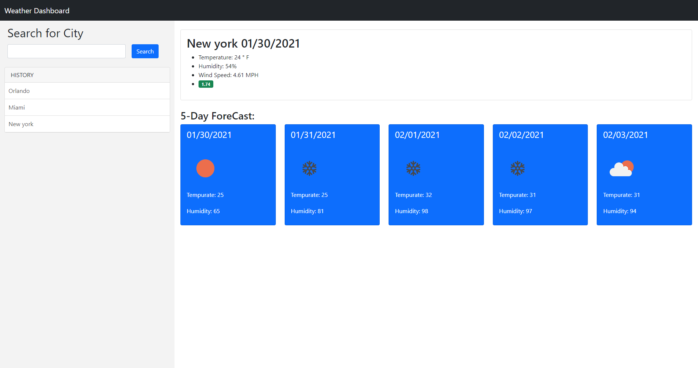

# weather-dashboard

## Description 

Create a weather dashbord to show current and future forecast for given city

Acceptance Criteria
* search by city
* add city to search history
* display date & current weather conditions (temperature, humidity, wind speed, UV index)
* display 5 day forecast (temperature, humidity) with visual icon
* search history presents current and futre conditons for that city

## Table of Contents (Optional)

* [Screenshot](#Screenshot)
* [Live Url](#live)
* [Repository Url](#repositiory)
* [License](#license)

## Screenshot 

Screenshot of final web page

## live

Live URL of site

https://jmax407.github.io/weather-dashboard

## Repository

https://github.com/jmax407/weather-dashboard

## License

N/A